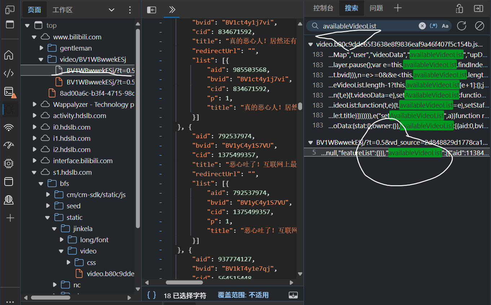
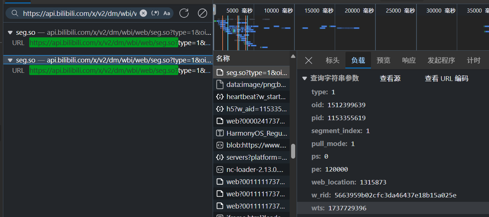
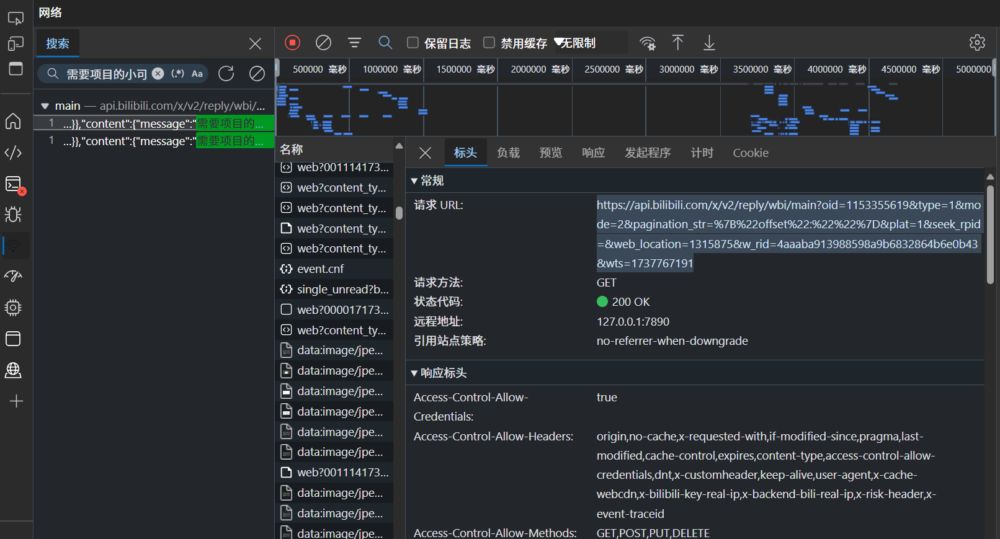

# 技术实现：

## 查找Api接口：

### 弹幕
aid (AV号): 视频的AV号码。  
bvid (BV号): BV号是B站后来引入的一种视频标识符，用来替代原有的AV号。暂时两个都有。  
cid (Comment ID): 视频弹幕ID。 

## BVID和AVID互相转换：  
https://api.bilibili.com/x/web-interface/view?bvid=BV1Pj411S7LW

https://api.bilibili.com/x/web-interface/view?aid=445203798

TYPE:
1    # 视频
12   # 专栏
17   # 单集（番剧/影视）

B 站评论分为一级评论和二级评论（回复评论）。

v1版本的弹幕列表接口：  
https://api.bilibili.com/x/v1/dm/list.so?oid=CID
用途：获取视频的所有弹幕数据，一次性返回。  
一般就一个

v2版本的分段弹幕接口：
https://api.bilibili.com/x/v2/dm/wbi/web/seg.so?.....  
用途：按视频的分段获取弹幕数据，适合长视频或需要按时间段管理弹幕的场景。  
有时候接口有好几个，下图就是两个。

检查，availableVideoList,分集视频的相关信息

### 评论

开发者工具中搜索某个评论内容，查找Api接口，
长这个样，有可能有好几个。  
https://api.bilibili.com/x/v2/reply/main.....

